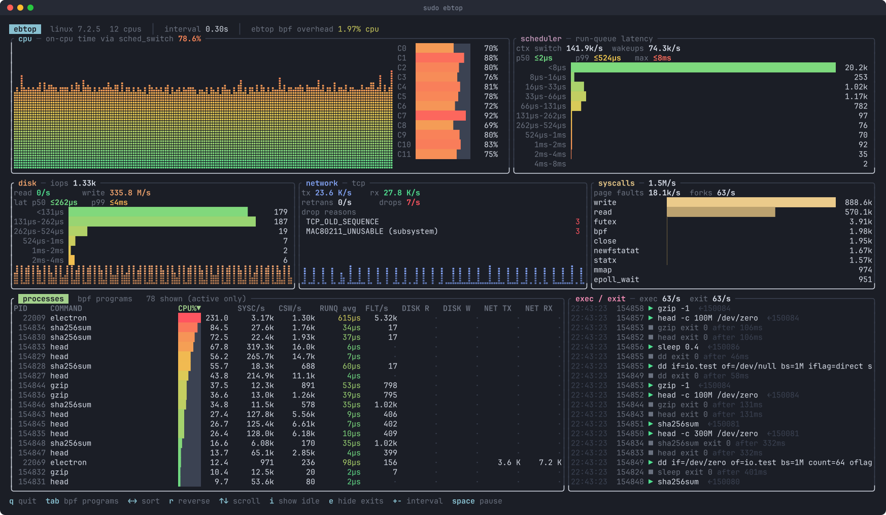

# 🌊 ebtop

[](https://github.com/vdo/ebtop/actions/workflows/ci.yml)
[](https://github.com/vdo/ebtop/releases/latest)
[-blue)](#license)

A btop-style, real-time dashboard of kernel activity, built on eBPF.

Where `top`/`btop` sample `/proc`, ebtop hooks the kernel directly, so it can
show things `/proc` can't: how long runnable tasks wait for a CPU, block I/O
latency, why packets are being dropped, every exec and exit (including
processes too short-lived for `top` to catch), and what the BPF programs
already loaded on your system are costing.



## Panels

| Panel | What it shows | Source |
|---|---|---|
| **cpu** | Total and per-core busy %, braille history graph | `sched_switch` on-CPU accounting |
| **scheduler** | Context switches/s, wakeups/s, run-queue latency p50/p99/max + log2 histogram | `sched_wakeup`, `sched_wakeup_new`, `sched_switch` |
| **disk** | IOPS, read/write throughput, device latency p50/p99 + histogram | `block_bio_queue`, `block_rq_issue`, `block_rq_complete` |
| **network** | TCP tx/rx bytes/s, retransmits/s, packet drops/s by kernel drop reason | `tcp_sendmsg`, `tcp_cleanup_rbuf`, `tcp_retransmit_skb`, `kfree_skb` |
| **syscalls** | Total rate, top syscalls by name, page faults/s, forks/s | `sys_enter`, `page_fault_user`, `sched_process_fork` |
| **processes** | Per process: CPU%, syscalls/s, ctx switches/s, avg run-queue wait, faults/s, disk R/W, TCP TX/RX | all of the above, keyed by tgid |
| **bpf programs** | Every loaded BPF program: type, full name, events/s, avg ns/run, CPU% (like bpftop) | `BPF_PROG_GET_NEXT_ID` + run-time stats |
| **exec / exit** | Live feed of execs (full argv, parent pid) and exits (status/signal, lifetime) | `sched_process_exec`, `sched_process_exit` |

## Install

Download a prebuilt binary for x86_64 or aarch64 from the
[latest release](https://github.com/vdo/ebtop/releases/latest). libbpf, libelf
and zlib are linked statically, so it only needs glibc 2.35 or newer.

```sh
arch=$(uname -m)   # x86_64 or aarch64
tag=$(curl -s https://api.github.com/repos/vdo/ebtop/releases/latest | grep -Po '"tag_name": "\K[^"]+')
curl -LO "https://github.com/vdo/ebtop/releases/download/$tag/ebtop-$tag-$arch-unknown-linux-gnu.tar.gz"
tar xzf ebtop-*.tar.gz && sudo install ebtop-*/ebtop /usr/local/bin/
sudo ebtop
```

Or build from source:

```sh
cargo install --locked --git https://github.com/vdo/ebtop
```

## Requirements

- Linux 5.18+ with BTF (`/sys/kernel/btf/vmlinux`, i.e. `CONFIG_DEBUG_INFO_BTF=y`),
  on x86_64 or aarch64. Developed on 7.2; CI tests every change on the GitHub
  runner kernels for both architectures.
- Root (or `CAP_BPF` + `CAP_PERFMON`) to run.
- To build: Rust 1.88+, `clang`, and the libelf and zlib development packages
  (Debian/Ubuntu: `clang libelf-dev zlib1g-dev pkg-config`). The libbpf headers
  come bundled with the build tooling.

No `bpftool` or generated `vmlinux.h` needed: the BPF side declares minimal
CO-RE struct views and libbpf relocates them against the running kernel.

## Usage

```sh
sudo ebtop                  # or ./target/release/ebtop when built from source
```

```
-i, --interval SECONDS   refresh interval (default 1.0)
-t, --theme NAME|PATH    btop color theme (see Themes below)
    --transparent        keep the terminal's background instead of the theme's
    --list-themes        list available themes and exit
    --dump               sample one interval, print a text summary and exit
-V, --version            print version and exit
```

`--dump` is handy for scripts, SSH sessions without a full terminal, or
checking that all probes load on a given kernel.

## Keys

| Key | Action |
|---|---|
| `1`–`7`, or click a panel | zoom that panel to full screen; press again or click anywhere to restore |
| `tab` | switch between processes and BPF programs |
| `←` `→` | change sort column |
| `r` | reverse sort |
| `↑` `↓` `PgUp` `PgDn` `g`, mouse wheel | scroll |
| `i` | show/hide idle processes |
| `e` | show/hide exits in the feed |
| `t` `T` | next / previous theme |
| `+` `-` | refresh interval ±250 ms |
| `space` | pause |
| `Esc` | restore from zoom, otherwise quit |
| `q` | quit |

## Themes

ebtop uses [btop](https://github.com/aristocratos/btop)'s color themes, with
the same file format and semantics, so it looks like your btop out of the box:

- All 41 themes that ship with btop are bundled, plus btop's built-in
  `Default` and `TTY` (16-color) themes.
- Theme files in `~/.config/btop/themes`, `~/.config/ebtop/themes` and
  `/usr/share/btop/themes` are picked up too, and override bundled ones with
  the same name. Under `sudo`, the invoking user's home is searched.
- The theme is chosen by `--theme`, else `color_theme` in
  `~/.config/ebtop/ebtop.conf`, else `color_theme` in btop's own
  `~/.config/btop/btop.conf`, else `Default`. `theme_background = false` in
  either file (or `--transparent`) keeps the terminal's background.

```sh
ebtop --list-themes               # * marks the active one; no root needed
sudo ebtop -t nord
echo 'color_theme = "gruvbox_dark"' > ~/.config/ebtop/ebtop.conf
```

Press `t` / `T` to cycle through themes live.

## How it works

- `src/bpf/ebtop.bpf.c` — one BPF object, 15 programs (mostly `tp_btf`/`fentry`).
  Global counters and histograms are per-CPU slots in `.bss`, so hot paths
  never contend and userspace reads them straight from the mmap'd skeleton
  with no syscalls. Per-process stats live in an LRU hash keyed by tgid;
  run-queue timestamps use task-local storage. Exec/exit events go through a
  ring buffer.
- `src/bpf.rs` — loads the skeleton, reads cumulative snapshots, lists
  system-wide BPF programs, and resolves syscall names (embedded from the UAPI
  headers at build time) and drop reason names (kernel BTF).
- `src/app.rs` — diffs consecutive snapshots into rates, percentiles and rows.
- `src/ui.rs` — ratatui rendering.

### Overhead

ebtop reports its own cost in the header. On a 12-core desktop it measured
about 0.06% of total CPU; the most expensive probe is `sched_switch` at
~500 ns/event. Run-time stats (`kernel.bpf_stats_enabled`) are switched on
while ebtop runs, which adds a few ns to every BPF program on the system, and
are released on exit.

## Caveats

- Buffered writes are charged to the kernel threads that flush them
  (`kworker`), not the process that wrote them. Direct I/O and reads are
  attributed to the caller.
- Network counts TCP only.
- The exec feed captures up to 256 bytes of argv.
- Page faults are only counted on x86 (the `exceptions:page_fault_user`
  tracepoint doesn't exist elsewhere).

## Contributing

See [CONTRIBUTING.md](CONTRIBUTING.md). Security issues: see
[SECURITY.md](SECURITY.md).

## License

The bundled themes in [`themes/`](themes) come from btop and are licensed
under Apache-2.0; see [themes/README.md](themes/README.md).

The BPF programs in [`src/bpf/`](src/bpf) are licensed under
[GPL-2.0](LICENSE-GPL-2.0), which the kernel requires for the helpers they
use. Everything else is licensed under either of

- [Apache License, Version 2.0](LICENSE-APACHE)
- [MIT license](LICENSE-MIT)

at your option.
